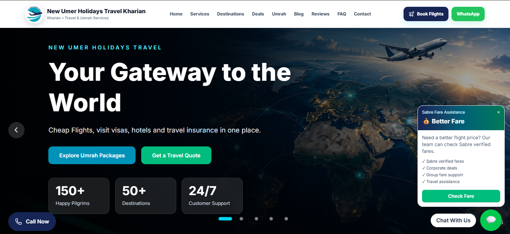
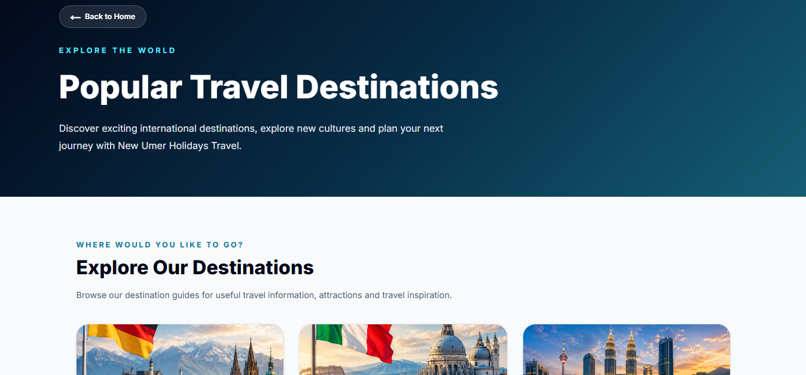
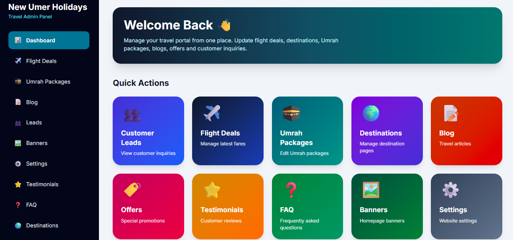
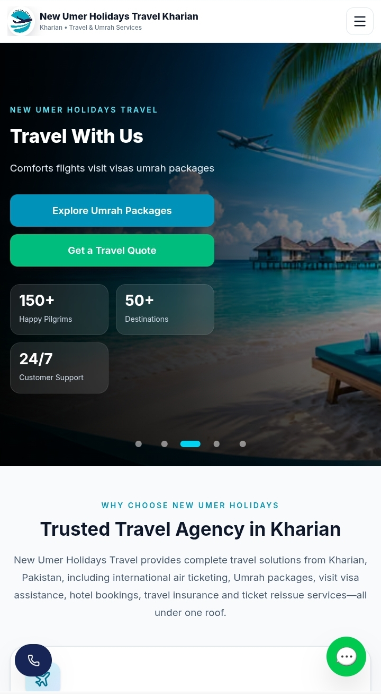

# ✈️ New Umer Holidays Travel Portal

A production travel portal developed for **New Umer Holidays Travel**.

🌐 **Live Website:** https://newumerholidays.com/

## 📌 About the Project

This project involved designing and developing a modern digital travel
platform for a real-world travel business.

The goal was to bring travel services, flight search, destination
information, customer inquiries, travel content, and business
management into one platform.

## 🚀 Key Features

- ✈️ Flight search and integration
- 🌍 Destination information and travel pages
- 🎯 Travel deals and packages
- 📝 Travel guides and blog content
- 📱 WhatsApp customer communication
- 📩 Lead generation
- ⚙️ Admin content management
- 🔎 SEO-focused pages and structured content
- 📱 Responsive/mobile-friendly design
- ☁️ Supabase backend and database integration

## 🛠️ Technology Stack

- Next.js
- React
- Tailwind CSS
- Supabase
- SQL
- Vercel
- SEO & Structured Data

## 👨‍💻 My Role

I worked across the project from the business and technical sides,
including:

- Understanding business requirements
- Translating business requirements into digital features
- Process improvement
- Website development
- Database/backend integration
- Content structure
- SEO implementation
- Deployment
- Ongoing optimization
- Mobile experience improvements

## 🖥️ Project Screenshots

### Homepage

### Destination Page

### Admin Dashboard

### Mobile Experience

## 🔗 Live Project

**Website:** https://newumerholidays.com/

## 🔒 Source Code

The production source code is maintained in a private repository
because this is a client project.

This public repository is a project showcase and does not contain
the client's production source code, credentials, or confidential data.
